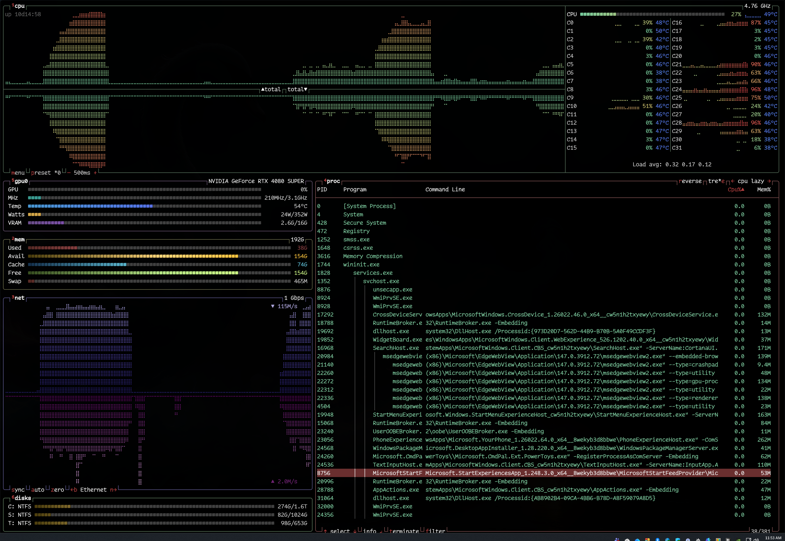

<div align="center">

# rtop

**A terminal-based system monitor for Windows, inspired by [btop](https://github.com/aristocratos/btop).**

Written in Rust. Fast. Beautiful.

[](https://github.com/freddiehaddad/rtop/releases)
[](https://www.rust-lang.org/)
[](LICENSE)



</div>

---

## What is rtop?

rtop is a resource monitor that shows CPU, memory, disk, network, GPU, and process information in a single terminal window. It's built from the ground up for **Windows** using native Win32 APIs.

The UI design is based on [btop](https://github.com/aristocratos/btop) by aristocratos, reimagined in Rust with Windows-native data collection and several enhancements:

- **Disk is a separate widget** — independently toggleable, not embedded in the memory panel
- **Preset system** — cycle through curated layout presets with `p` / `P`
- **Custom layouts** — beyond the built-in presets, arrange widgets into rows, columns, and nested panels with adjustable proportions ([details](#custom-layout))
- **GPU monitoring** — NVIDIA (NvAPI), AMD (ADL), and Intel (IGCL)
- **CPU temperature and power** via PawnIO kernel driver
- **Per-widget dirty rendering** — only redraws what changed
- **Per-widget refresh rates** — set individual update intervals for each widget
- **41 bundled themes** — dracula, nord, gruvbox, tokyo-night, and more
- **Vim key bindings** — optional h/j/k/l/g/G and Ctrl+F/B/D/U navigation
- **Process following** — pin a process with `F` to auto-scroll across refreshes
- **Clock display** — configurable clock in the CPU widget
- **Disk IO mode** — toggle between usage meters and throughput graphs

## Features

| Widget | Data |
|--------|------|
| **CPU** | Per-core utilization, frequency, temperature¹, power (watts)¹, user/system graphs, load average, uptime, clock |
| **Memory** | Used, available, cached, free, swap — with meter bars |
| **Disk** | Per-volume usage, filesystem type, capacity, read/write throughput, busy time, IO mode |
| **Network** | Download/upload graphs with auto-scaling, interface selector, speed totals |
| **GPU** | Utilization, temperature, VRAM, power draw, clocks (NVIDIA, AMD, Intel) |
| **Process** | PID, name, command line, CPU%, memory, tree view, filter, sort, follow, terminate |

¹ Temperature and power readings require [PawnIO](#cpu-temperature--power) and Administrator privileges.

### Keybinds

| Key | Action |
|-----|--------|
| `m` / `Esc` | Toggle main menu |
| `?` / `F1` | Help |
| `o` / `F2` | Options |
| `1`–`5` | Toggle widgets (cpu/mem/net/proc/disk) |
| `6`–`9` | Toggle GPU 0–3 |
| `0` | Toggle GPU 4–7 |
| `Shift+R` | Restore all hidden widgets |
| `p` / `P` | Cycle presets forward/back |
| `Ctrl+R` | Reload config from file |
| `+` / `-` | Adjust update speed |
| `f` / `/` | Filter processes |
| `e` | Toggle tree view |
| `r` | Toggle reverse sort |
| `c` | Toggle per-core CPU |
| `i` | Toggle disk IO mode |
| `Enter` | Show/hide process details |
| `F` | Follow/unfollow process |
| `t` | Terminate process (graceful, double-tap) |
| `T` | Kill process (force, double-tap) |
| `n` / `b` | Cycle network interfaces |
| `a` | Toggle network auto scale |
| `s` | Toggle network sync scale |
| `z` | Reset network totals |
| `q` | Quit |

When **vim keys** are enabled (options → general):
`h`/`j`/`k`/`l` for directional control, `g`/`G` for top/bottom of list, `Ctrl+F`/`Ctrl+B` for page scrolling, `Ctrl+D`/`Ctrl+U` for half-page scrolling.

See the built-in help menu (`?` / `F1`) for the complete list.

---

## Installation

### Download a release

1. Go to [Releases](https://github.com/freddiehaddad/rtop/releases)
2. Download the latest `rtop-x.y.z.zip`
3. Extract `rtop.exe` to a directory in your `PATH`
4. Run `rtop` from any terminal (Windows Terminal recommended)

### Build from source

**Requirements:**
- [Rust](https://rustup.rs/) (stable toolchain)
- Windows 10/11 SDK (included with Visual Studio Build Tools)

```powershell
git clone https://github.com/freddiehaddad/rtop.git
cd rtop
cargo build --release
```

The binary is at `target\release\rtop.exe`.

**Run tests:**

```powershell
cargo test
```

---

## CPU Temperature & Power

CPU temperature and power readings require [PawnIO](https://pawnio.eu), a signed kernel driver that lets rtop read sensor data directly from the CPU. Supported on Intel and on AMD Zen and newer (Ryzen, Threadripper, EPYC). Without PawnIO, rtop runs normally and the temperature and power fields stay blank.

### Install via winget

```powershell
winget install --id namazso.PawnIO
```

After install, the PawnIO kernel driver and service are loaded automatically — no reboot required.

### Run rtop as Administrator

To see CPU temperature and power, launch rtop as Administrator (right-click `rtop.exe` → "Run as administrator", or open it from an elevated terminal). Without admin rights, rtop runs normally — the temperature and power rows just don't appear in the CPU widget.

---

## GPU Monitoring

rtop detects GPUs from all three major vendors automatically at runtime. For each detected device it reports **utilization, temperature, VRAM, power, and clocks**. Unlike CPU temperature and power, GPU monitoring needs no extra software beyond the vendor's graphics driver and no elevation.

| Vendor | Supported GPUs |
|--------|---------------|
| **NVIDIA** | GeForce 600 series (Kepler) and newer |
| **AMD** | Vega and newer (RX Vega, 5000, 6000, 7000, 9000 series) |
| **Intel** | Arc discrete GPUs |

Up to 8 GPUs are supported. Mixed GPU systems show all detected devices. If a vendor's driver is not installed, that backend is silently skipped.

---

## Configuration

rtop stores its config at:

| Location | Path |
|----------|------|
| Config | `%APPDATA%\rtop\rtop.toml` (or `$XDG_CONFIG_HOME/rtop/`) |
| Logs | `%LOCALAPPDATA%\rtop\` (or `$XDG_STATE_HOME/rtop/`) |

The config file is created automatically on first run when `save_config_on_exit` is enabled (default). All options are editable from the built-in options menu (`o` / `F2`).

To print the default config:

```powershell
rtop --default-config
```

### Themes

rtop ships with 41 built-in themes. Change the theme from the options menu (General → Color Theme) or set it in `rtop.toml`:

```toml
color_theme = "dracula"
```

### Per-Widget Update Intervals

By default all widgets share the global `update_ms` interval (default 2000ms). Each widget can override this with its own interval:

```toml
update_ms = 2000
cpu_update_ms = 1000     # CPU updates every 1s
proc_update_ms = 5000    # Processes update every 5s
mem_update_ms = 0        # 0 = use global (2000ms)
```

Set per-widget intervals via the options menu (each category tab has an update interval option) or in `rtop.toml`.

### Custom Layout

Want a layout that's different from the built-in presets? rtop lets you describe one with a small expression that combines widgets with vertical (`vstack`) and horizontal (`hstack`) panels. You choose both **which widgets are visible** and **how they're arranged**, including how wide each column should be.

The grammar:

```
shape := widget                                            # a single widget
       | vstack(shape, shape, ...)                         # children stacked top-to-bottom
       | hstack(weight:shape, weight:shape, ...)           # children laid out left-to-right
                                                           # weight is 1..255 (relative width share)
```

Widgets are `cpu`, `mem`, `net`, `proc`, `disk`, and `gpu0`..`gpu7`. Each widget kind may appear at most once in a shape.

Edit the custom layout two ways:

1. **Options menu** (`o` or `F2`) → general → `shape` — type a new DSL expression and press Enter. Cycle to the `custom` preset (`p` / `P`) to see the result.
2. **`rtop.toml`** — set `preset = "custom"` and edit the `shape` string under `[layout]`.

#### Example 1 — minimal

CPU graph on top, processes filling the rest:

```toml
preset = "custom"

[layout]
shape = "vstack(cpu, proc)"
```

#### Example 2 — two-column dashboard with custom proportions

CPU spans the full width on top. Below, a left column stacks memory, network, and disk; the right column is the process list. The 40/60 weights give processes 60% of the width:

```toml
preset = "custom"

[layout]
shape = "vstack(cpu, hstack(40:vstack(mem, net, disk), 60:proc))"
```

### Hiding widgets at runtime

The number keys (`1`–`5` for cpu/mem/net/proc/disk, `6`–`9` for gpu0–3, `0` for gpu4–7) hide and restore individual widgets in the active layout. Hidden widgets stay hidden across preset cycles and across restarts (the filter is persisted in `rtop.toml`). Press `Shift+R` to restore everything in one keypress. The CPU widget shows a `*` next to the preset name when any widget is hidden, so the filter never feels invisible.

Hide is purely a viewing operation — it never modifies your saved layout. The Custom preset's shape is only changed by the two paths above.

---

## Command Line Options

```
Usage: rtop [OPTIONS]

Options:
  -c, --config <FILE>     Path to config file
  -f, --filter <TEXT>     Initial process filter
  -u, --update <MS>       Update interval in milliseconds (min 100)
      --default-config    Print default config and exit
  -h, --help              Print help
  -V, --version           Print version
```

---

## Acknowledgments

- [btop](https://github.com/aristocratos/btop) by aristocratos — the original system monitor that inspired rtop's UI design
- [crossterm](https://github.com/crossterm-rs/crossterm) — terminal I/O
- [windows-rs](https://github.com/microsoft/windows-rs) — Windows API bindings
- [PawnIO](https://pawnio.eu) by namazso — signed kernel driver for CPU MSR access
- [PawnIO.Modules](https://github.com/namazso/PawnIO.Modules) — `IntelMSR` and `AMDFamily17` bytecode modules embedded by rtop, licensed under LGPL-2.1-or-later

---

## License

[GPL-2.0-or-later](LICENSE)
